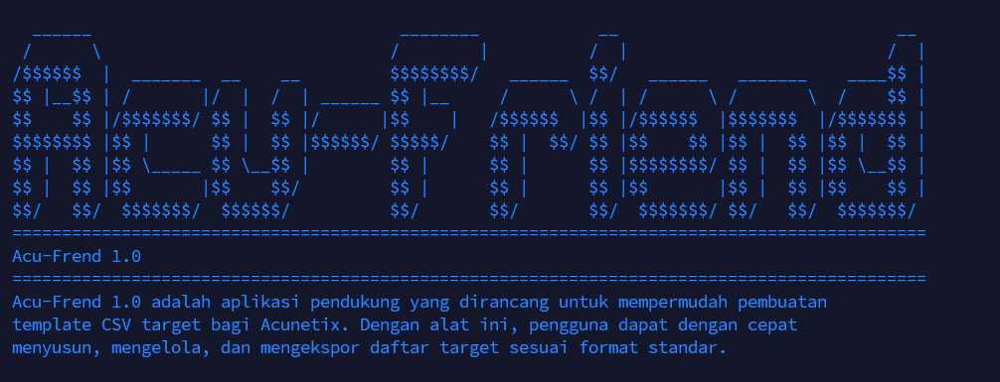

# Acu‑Frend 1.0

    

---

## Ringkasan Singkat (TL;DR)
Acu‑Frend 1.0 mengubah tugas berulang: *menyusun daftar target untuk Acunetix* menjadi langkah cepat, handal, dan dapat direplikasi. Jalankan satu perintah, dan Anda mendapatkan CSV target yang sempurna, diberi nama rapi, dan siap diimpor ke Acunetix atau disimpan sebagai artefak audit.

> Hasil nyata: hemat waktu, mengurangi kesalahan manual, dan membuat proses pemindaian dapat direproduksi untuk tim atau laporan.

---


---

## Mengapa Acu‑Frend? (Kenapa tidak skip)
- **Langsung ke inti:** Tidak ada setup rumit — jalankan script, dapatkan CSV.  
- **Terstruktur untuk tim:** Nama file hasil otomatis memudahkan pelacakan (sumber → hasil).  
- **Aman dan jelas:** Validasi URL mencegah sampah masuk ke pipeline pemindaian.  
- **Dapat disambungkan ke workflow:** Mudah dipasangkan ke CI/CD, reporting, dan tools bug-bounty.

---

## Fitur Kunci
- Pembuatan CSV target dengan format standar Acunetix.
- Validasi URL otomatis (`http://` atau `https://`).
- Opsi header on/off dan `--force` untuk menimpa output.
- Dukungan input: file list, direktori, atau URL tunggal.
- Mode laporan (`-l`) yang menamai file output berdasarkan sumber.
- Kompatibel Windows & Linux.

---

## Persiapan & Instalasi
1. Pastikan Python 3.8+ terpasang.
2. Clone repo:

```bash
git clone https://github.com/bernic777/acu-frend.git
cd acu-frend
```

3. Install dependensi:

```bash
pip install -r requirements.txt
# atau untuk minimal: pip install colorama
```

---

## Quick Start — 3 Langkah
1. Siapkan file `targets.txt` (satu URL per baris).
2. Jalankan perintah:

```bash
python acu-frend.py targets.txt -o results/acunetix_targets.csv -p "Full Scan" -c High -g BugBounty
```

3. Import `results/acunetix_targets.csv` ke Acunetix.

---

## Opsi CLI (Lengkap)
```
USAGE: python acu_frend.py INPUT_FILE [options]

Positional:
  INPUT_FILE            Jalur ke file targets.txt

Options:
  -o, --output          Path ke file CSV output (default: acunetix_targets.csv)
  -p, --profile         Nama scan profile (default: "Default Scan")
  -c, --criticality     Criticality (High|Medium|Low) (default: High)
  -g, --group           Target group name (default: Default Group)
  --no-header           Jangan tambahkan header CSV
  -f, --force           Timpa file yang sudah ada tanpa konfirmasi
  -u, --url             Tambah single URL langsung dari CLI
  -d, --directory       Proses semua file targets dalam folder
  -l                    Mode laporan otomatis (penamaan file berdasarkan sumber)
```

---

## Contoh Penggunaan Real-World
1. Proses file list standar, gunakan profil `Full Scan` dan grup `Engagement-2025`:

```bash
python acu_frend.py targets.txt -o output/engagement-2025.csv -p "Full Scan" -c High -g "Engagement-2025"
```

2. Satu target langsung dari CLI:

```bash
python acu_frend.py -u https://example.com -o output/example.csv -p "Quick Scan" -c Medium
```

3. Batch dari folder (semua file `.txt` diproses):

```bash
python acu_frend.py -d ./targets/ -l
```

---

## Contoh Input & Output
**targets.txt**
```
https://example.com
http://test.local
invalid-url
```

**acunetix_targets.csv** (hasil)
```
Target_URL,Scan_Profile,Criticality,Target_Group
https://example.com,Full Scan,High,BugBounty
http://test.local,Full Scan,High,BugBounty
```
> Catatan: `invalid-url` dilewati dan diperingatkan di console.

---

## Bagaimana Ini Membantu Tim Anda
- **Auditability:** Nama file hasil & opsi header membuat CSV siap dilampirkan ke laporan.  
- **Integrasi CI:** Jalankan di pipeline untuk memperbarui target otomatis sebelum scanning terjadwal.  
- **Reproducibility:** Command yang sama selalu menghasilkan file dengan struktur konsisten.

---

## Keamanan & Etika
- Pastikan Anda memiliki izin eksplisit sebelum memindai/menargetkan domain atau jaringan.
- Tool ini hanya membantu penyusunan file target — tanggung jawab penggunaan ada pada operator.

---

## Pengembangan & Roadmap (Mind‑blowing next)
1. Integrasi API Acunetix untuk upload otomatis hasil.  
2. Output alternatif: JSON & XLSX terstruktur untuk laporan.  
3. Mode paralel (multiprocess) untuk memproses jutaan target.  
4. Plugin untuk platform bug-bounty populer (HackerOne/Bugcrowd) agar sinkron:
   - Otomatis mengekstrak scope dan generate target list.  

---

## Kontribusi
Kontribusi sangat dihargai. Alur singkat:
1. Fork repo  
2. Buat branch fitur: `feature/your-feature`  
3. Buat PR berisi deskripsi dan changelog singkat  
4. Tests dan dokumentasi lebih disukai

---

## Changelog Singkat
- **v1.0** — Initial release: CSV generator, URL validation, CLI options.

---

## Lisensi
MIT License — bebas digunakan, dimodifikasi, dan didistribusikan.

---

## Kontak
Jika ingin berdiskusi fitur, laporan bug, atau kerja sama: buka issue di GitHub atau buat PR langsung.

---

> _Acu‑Frend 1.0 — buat persiapan scanning jadi cepat, rapi, dan dapat dipercaya._
